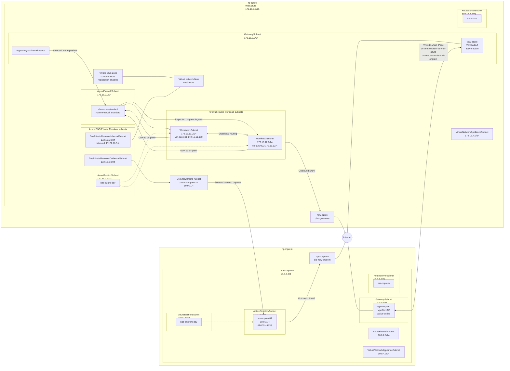

# Network Diagram

This diagram reflects the lab topology defined by [main.bicep](main.bicep), [modules/onprem.bicep](modules/onprem.bicep), and [modules/azure.bicep](modules/azure.bicep).

## Key Paths

- `vm-azure01` lives in `Workload1Subnet` at `172.16.11.100`.
- `vm-azure02` lives in `Workload2Subnet` at `172.16.12.4`.
- `vm-onprem01` lives in `ActiveDirectorySubnet` at `10.0.11.4` and provides AD DS and DNS for `contoso.onprem`.
- Both VPN gateways are active-active because Azure Route Server is deployed in both VNets.
- `ngw-onprem` is associated to the on-prem `ActiveDirectorySubnet` and `ngw-azure` is associated to the Azure custom workload subnets for outbound SNAT.
- `rt-gateway-to-firewall-transit` is associated to the Azure `GatewaySubnet` and sends selected Azure destination prefixes from VPN ingress to Azure Firewall.
- The Azure workload subnets route on-prem traffic via `afw-azure-standard`; workload subnet-to-subnet traffic uses VNet local routing.
